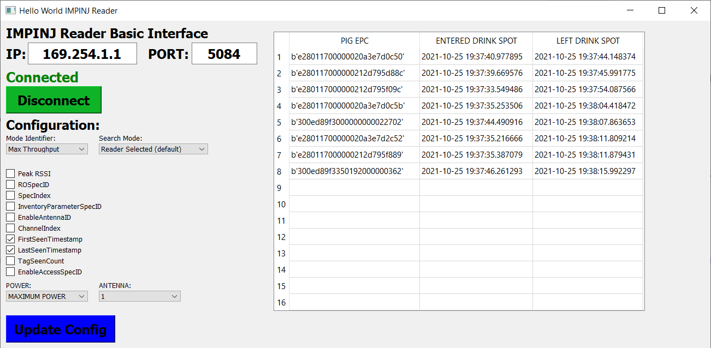

# IMPINJ Reader Connect and Config

IMPINJ_Reader is a QT Graphical Interface to control and configure IMPINJ readers.

Authors:
    - Vinícius Jean Ferreira
   

IMPINJ_Reader is a GUI frontend to the sllurp Python library, an implementation of a client for the Low Level Reader Protocol.

The experimental v2 version of Sllurp is required for this GUI
(see: github.com/fviard/sllurp/tree/fviard-develop-v2)

The GUI relies on PyQt5, pyqtgraph and using Python 3.6 or higher is
recommended. It has been tested on windows and Raspberry Pi 3B+

Important warning:
This project is in a Work In Progress state, and a few bugs and unfinished
features are to be expected.

--- Original readme from qtgui ---

